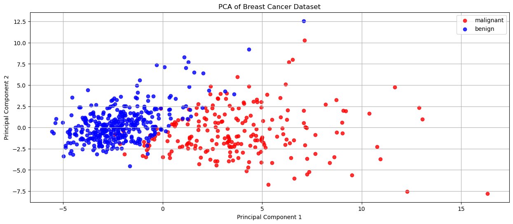

# Machine Learning

In this repo we are going to practice some supervised and unsupervisd learning

- perform supervised learning
  - Naive Bayes
  - SVM
  - KNN
- perform unsupervised learning
- use dimensionality reduction and Manifold Learning 

    

